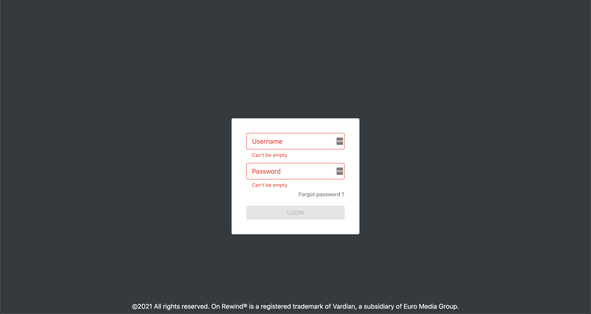

# HOW TO START THE APP

```
required : node v15.10.0

nvm use or use node v15.10.0

npm install
```

### Run local 
```
npm start
```
### Credentials

```
login : test
password : livetest
```


# TASKS

### TODO 

1. Create a new branch
2. Fix the current bug preventing the page to load
3. Add a form as per screenshot : 
   
4. Connect the form to the appropriate method


Form behavior : 
* It must raise an error if one the fields is empty, and displays a message
* the login button must be disabled if an error is raised
* 'Forgot password' sentence must redirect to "/forgotPassword"

5. Add a page to display user's video

### BONUS

Use the background image constant defined in ```config.js``` to set the background of the login page. If no URL is provided, the background must the theme primary color


***Please respect the below guidelines***

# STACK :
Our application is based on React/ContextAPI. (no Redux !)

See https://fr.reactjs.org/docs/context.html

### Generals standards :
  We tend to follow the AirBnB React Styleguide We also used Prettier an eslint for our code's linting Nearly all components are functions with Hooks. Our variables are written in camelCase. Components are written in PascalCase.

 * **WARNING** use destructured props (...props) with parsimony. Nested components with multiple destructured props can be difficult to track.
 * **WARNING** use ternary operator with parsimony. Avoid nesting ternary operators they can be difficult to track.

### Components standards :
 * <component_name>.view.jsx : the view ---> **MUST** be a stateless component
 * <component_name>.container.jsx : the container ---> connected to the store
 * <component_name>.module.scss : We use Sass module and try to avoid inline style unless necessary
 * <component_name>.constants.js : All constants used by the component are there.

#### The view :

The view is a *dumb* component (also called element) that **MUST** be a stateless component.
There is an example of a minimal view :

```
export default function <Component_name>View(props){
  return (
    <div>
      Your component view
    </div>
  );
}
```

#### The container :

The container is a *smart* component.
It provides all props that the view need.
This practice ensure that each time a props change, the view make a new render.
If you need to prevent a render on some props, you need to use memoization.

#### The style :

Each component is having his own stylesheet, this ensure more readibility and easier updating.

### File Structure

Src directory contains all the components.


```bash
src
├── Forms # All forms components
├── Layout 
├── Pages # Main components
├── Renderers # Input adapters for final forms
├── assets # Pictures and logos for the website
├── constants # Global app constants
├── context # Global app context
├── models 
│   └── User # Class representing the current app user
├── utils
│   ├── Session # Class representing a Session stored to the localstorage
│   ├── api # Api endpoints constructor
│   └── hooks # Custom react hooks 
└── widgets # UI Components

```


